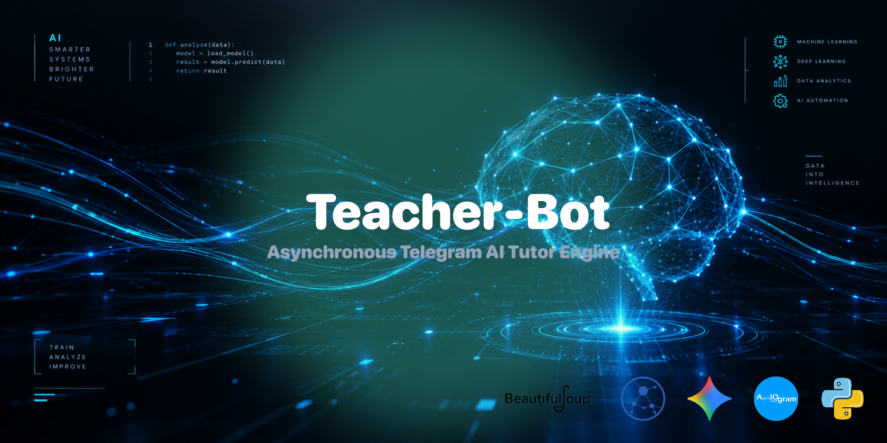

<p align="center">
  
</p>

<div align="center">

# 🤖 Teacher-Bot: Asynchronous Telegram AI Tutor Engine

</div>

A high-performance, event-driven Telegram AI Agent engineered with **Aiogram 3.x** and integrated directly with the state-of-the-art **Google Gemini 3.5 Flash Lite** model via the native Google AI Studio API. Designed as an intelligent, responsive personal mentor, it dynamically conducts step-by-step programming, web layout, and Computer Science tutorials without the need for manual, hardcoded lecture libraries.

<div align="center">

## 🎯 The Core Product Vision & Business Value

</div>

* **The Problem:** Traditional educational bots rely heavily on rigid inline menus, pre-written texts, and static databases. This approach makes content expansion extremely resource-intensive and leaves the student with no adaptive feedback when they write custom code or make mistakes.
* **The Solution:** A fully interactive AI Sandbox. The bot orchestrates a customized prompt-driven persona—a strict, charismatic Senior Developer—who guides users through 25 dynamic tech categories. It serves tailored theory blocks, instantly reviews user-submitted code in the chat, and tracks educational context seamlessly.

<div align="center">

## 🛠️ Key Technical Features & Capabilities

</div>

* **Native Gemini 3.5 Flash Lite Integration:** Built using clean, non-blocking asynchronous REST API requests via `aiohttp`, skipping heavy, bloated external SDKs for faster execution times.
* **Advanced Context & State Management:** Powered by Aiogram's built-in **FSM (Finite State Machine)**. The bot actively tracks the user's selected technology track, passing unified context layers to the model to ensure precise code-reviews and sequential exercises.
* **Background Data Layer Parsing:** Implements an asynchronous web scraper combining `aiohttp` and `BeautifulSoup4` (`lxml`). This architecture scans documentation networks completely in the background without causing thread-blocking freezes for active users.
* **Production-Grade Design Patterns:** Features modular directory routing, full PEP 8 code discipline, clean environment variable isolation (`python-dotenv`), and optimal package export declarations using native `__all__` definitions.

<div align="center">

## 📂 Production Code Architecture

</div>

```text
Teacher-Bot/
├── .gitignore
├── LICENSE
├── README.md
├── banner.png
├── main.py
├── requirements.txt
└── app/
    ├── __init__.py
    ├── config.py
    ├── ui_text.py
    │
    ├── keyboards/
    │   ├── __init__.py      
    │   └── inline.py
    │
    ├── services/
    │   ├── __init__.py
    │   ├── ai_engine.py
    │   └── web_parser.py
    │
    └── handlers/
        ├── __init__.py      
        ├── commands.py
        └── education.py
```

<div align="center">

## 🚀 Quick Local Deployment

</div>

1. Clone the repository:
   ```bash
   git clone https://github.com/Hades-db/Teacher-Bot
   ```
2. Navigate to the project directory:
   ```bash
   cd Teacher-Bot
   ```
3. Install the asynchronous environment stack:
   ```bash
   pip install -r requirements.txt
   ```
4. Create a `.env` configuration file in the root root folder:
   ```env
   TOKEN_TG_BOT=YOUR_TELEGRAM_BOT_TOKEN
   AI_API_KEY=YOUR_GOOGLE_AI_STUDIO_KEY
   ```
5. Launch the AI Agent:
   ```bash
   python main.py
   ```
